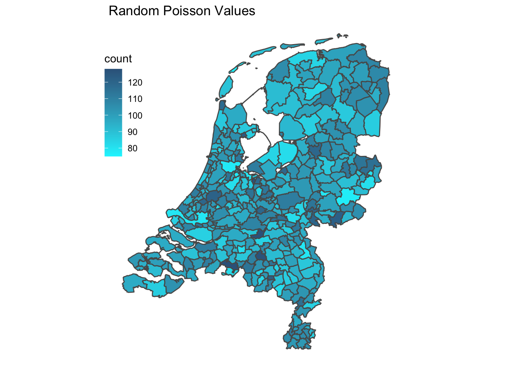
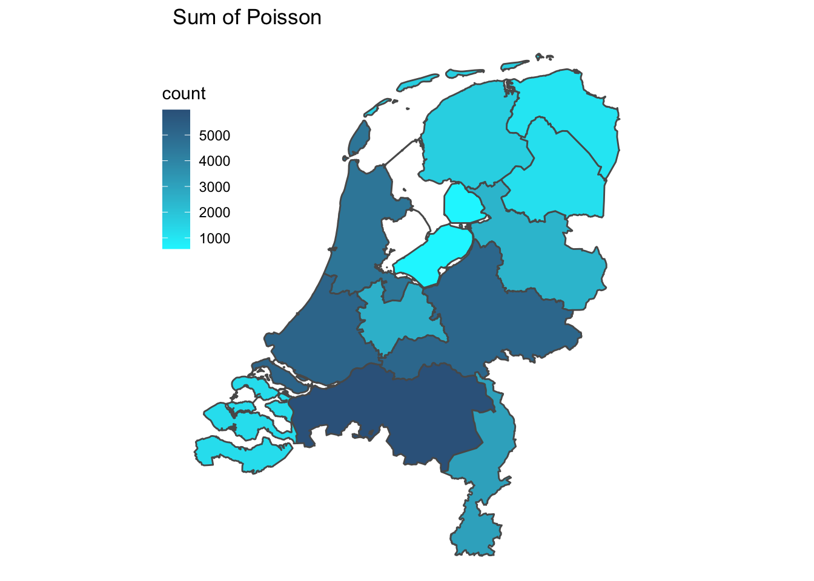
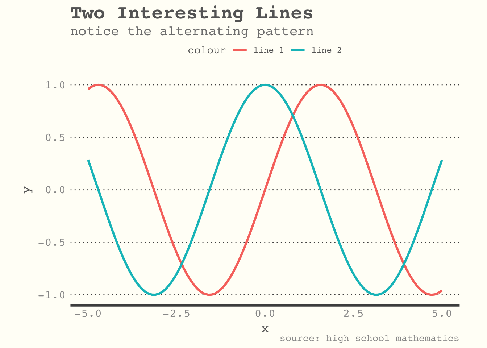

<!-- README.md is generated from README.Rmd. Please edit that file -->

<b> PRELIMINARY </b> package containing several function and themes for
`ggplot2`

# Installation

You can directly install this package from Github

``` r
devtools::install_github("TIvanDijk/TivD")
```

To replicate the output of this markdown file, you’ll need at least the
following packages

``` r
library(dplyr)
library(TivD)
library(ggplot2)
```

# Maps

For illustration purposes, we create a random dataset containing the
municipality, associated province and some random count value.

``` r
library(TivD)

df = cbind(GPdata[, c('gem', 'prov')], count = rpois(352, 100))
head(df)
##           gem      prov count
## 1   Eemsdelta Groningen   104
## 2   Groningen Groningen    86
## 3      Almere Flevoland   104
## 4 Stadskanaal Groningen   116
## 5     Veendam Groningen   102
## 6    Zeewolde Flevoland   105
```

To plot the counts per Dutch municipality, you can use the `NLDgem`
function.

``` r
NLDgem(df[, c('gem', 'count')], title = 'Random Poisson Values', varname = 'count')
```



To plot the counts per Dutch province, you can use the `NLDprov`
function. I first summarise the counts across the province to get the
dataset in the appropriate format.

``` r
df.prov <- dplyr::summarise( group_by(df, prov), count = sum(count))
## `summarise()` ungrouping output (override with `.groups` argument)
NLDprov(df.prov, title = 'Sum of Poisson', varname = 'count')
```



# Themes

To illustrate the themes, consider the following simple plot

``` r
p <- ggplot(data.frame(x = -5:5), aes( x = x)) +
  stat_function( fun = function(x) sin(x), size = 1.1, color = 'red') +
  stat_function( fun = function(x) cos(x), size = 1.1, color = 'blue')
```

### Notepad (`theme_notepad`)

``` r
p + theme_notepad()
```



# Other

  - setwd\_here()
  - GPdata
